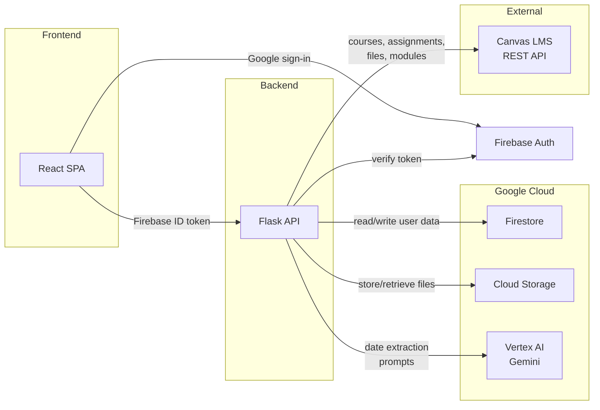

# CanvasSync

A full-stack web application that unifies Canvas LMS assignments with AI-extracted deadlines from syllabi, modules, and course documents into a single weekly and calendar view.

## The Problem

Canvas LMS is the most widely used learning management system in higher education, but it scatters deadline information across multiple surfaces:

- **Assignments tab** only shows items the instructor explicitly created as Canvas assignments.
- **Syllabus PDFs**, schedule spreadsheets, and other uploaded files often contain additional due dates that never appear in the assignments list.
- **Module pages**, front pages, and announcements may reference deadlines in unstructured text.

Students end up checking multiple places per course, across multiple courses, and still miss work that was only mentioned in a document or module item. Canvas has no native way to consolidate all of these sources into one timeline.

## Key Features

- **AI-powered date extraction** -- Uses Vertex AI (Gemini) to read syllabi, schedules, front pages, module items, and announcements, then extract and normalize due dates that Canvas itself does not surface.
- **Unified weekly and calendar views** -- All assignments from all synced courses appear in a single timeline, whether they originated from the Canvas assignments API or were discovered by AI from course documents.
- **Full Canvas API sync** -- Fetches courses, assignments (with submission status), announcements, modules, pages, files, and syllabus bodies through the Canvas REST API with paginated requests.
- **Completion tracking** -- Combines Canvas submission state with a manual checklist so students can track progress from both sources.
- **Google sign-in** -- Firebase Authentication with Google sign-in for cloud mode; data syncs across devices via Firestore.
- **Per-course color coding** -- Assign colors and star courses for quick visual identification.
- **Dark-themed responsive UI** -- Built with Material UI and Tailwind CSS with standard and vibrant color modes.
- **Dual runtime modes** -- Cloud mode (Firestore + Firebase Auth + GCS) for production, and local mode (SQLite, no auth) for development.

## Architecture



**Request flow:** The React frontend authenticates via Firebase (Google sign-in), then sends the Firebase ID token as a Bearer token on every API call. The Flask backend verifies the token, fetches or syncs data from the Canvas LMS API, stores it in Firestore, and optionally sends course documents to Vertex AI for date extraction. Results are returned to the frontend for display in the weekly or calendar view.

## Tech Stack

| Layer | Technologies |
|---|---|
| **Frontend** | React 19, Material UI 7, Tailwind CSS 3.4, Firebase Auth, Day.js, Axios |
| **Backend** | Python 3.11, Flask 3, Gunicorn, canvasapi |
| **Database** | Firestore (cloud) / SQLite (local) |
| **AI** | Vertex AI -- Gemini 2.5 Flash Lite |
| **Storage** | Google Cloud Storage |
| **Auth** | Firebase Admin SDK, Fernet-encrypted Canvas tokens |
| **Parsing** | pdfplumber, python-docx, openpyxl, BeautifulSoup, ics, feedparser |
| **Infrastructure** | Google Cloud Run, Docker |
| **Observability** | OpenTelemetry (AI usage telemetry) |

## Project Structure

```
canvas-organizer/
├── backend/
│   ├── app.py                  # Flask application and API routes
│   ├── auth.py                 # Firebase token verification and auth decorators
│   ├── db_firestore.py         # Firestore data access layer
│   ├── db.py                   # SQLite data access layer (local mode)
│   ├── storage.py              # Google Cloud Storage / local file storage
│   ├── cloud_cost_audit.py     # BigQuery billing analytics
│   ├── timezone_utils.py       # Timezone helpers
│   ├── ai/
│   │   ├── gemini_model.py     # Vertex AI Gemini integration
│   │   └── usage_telemetry.py  # Token/cost tracking with OpenTelemetry
│   ├── parsers/
│   │   ├── syllabus_text.py    # PDF and DOCX text extraction
│   │   ├── calendar_parser.py  # ICS calendar parsing
│   │   ├── rss_parser.py       # RSS/Atom feed parsing
│   │   ├── canvas_files.py     # Canvas file download and classification
│   │   ├── file_heuristic.py   # File type detection heuristics
│   │   └── safe_download.py    # Secure file downloading
│   ├── requirements.txt
│   ├── Dockerfile
│   └── .env.template
├── frontend/
│   ├── src/
│   │   ├── App.js              # Main application (views, state, UI)
│   │   ├── api.js              # API client with auth headers
│   │   ├── firebase.js         # Firebase Auth configuration
│   │   ├── theme.js            # MUI theme customization
│   │   └── index.js            # Entry point
│   ├── public/
│   ├── tailwind.config.js
│   ├── package.json
│   └── .env.template
├── SECURITY.md
└── .gitignore
```

## Getting Started

### Prerequisites

- Python 3.11+
- Node.js and npm
- A Canvas LMS account with an [API access token](https://community.canvaslms.com/t5/Admin-Guide/How-do-I-manage-API-access-tokens-as-an-admin/ta-p/89)

For cloud mode only:
- A Firebase project with Authentication (Google provider) enabled
- A GCP project with Vertex AI and Cloud Storage APIs enabled

### Local Development

Local mode runs with SQLite and no authentication, suitable for development and testing.

**Backend:**

```bash
cd backend
cp .env.template .env
# Edit .env -- ensure USE_FIRESTORE=false (the default)
# Optionally set CANVAS_API_URL and CANVAS_API_TOKEN for local mode

python -m venv venv
source venv/bin/activate   # On Windows: venv\Scripts\activate
pip install -r requirements.txt

python app.py
```

The backend starts on `http://localhost:5000` by default.

**Frontend:**

```bash
cd frontend
cp .env.template .env.local
# .env.template already sets REACT_APP_API_URL=http://localhost:5000

npm install
npm start
```

The frontend starts on `http://localhost:3000` and proxies API calls to the backend.

### Cloud Deployment

The backend is designed for Google Cloud Run. The included Dockerfile builds a production image:

```bash
cd backend
docker build -t canvas-organizer-backend .
docker run -p 8080:8080 \
  -e CANVAS_TOKEN_ENCRYPTION_KEY=<your-fernet-key> \
  canvas-organizer-backend
```

Generate a Fernet encryption key:

```bash
python -c "from cryptography.fernet import Fernet; print(Fernet.generate_key().decode())"
```

For a full cloud deployment, configure the environment variables listed in the next section and deploy to Cloud Run. The frontend can be deployed to Firebase Hosting or any static hosting provider after running `npm run build` with `REACT_APP_API_URL` set to the Cloud Run service URL.

## Environment Variables

Both `.env.template` files document every variable with inline comments. The most important ones:

### Backend (`backend/.env.template`)

| Variable | Required | Default | Description |
|---|---|---|---|
| `USE_FIRESTORE` | Yes | `false` | `true` for cloud mode (Firestore + Auth), `false` for local (SQLite) |
| `CANVAS_TOKEN_ENCRYPTION_KEY` | Cloud mode | -- | Fernet key for encrypting stored Canvas API tokens |
| `FIREBASE_PROJECT_ID` | Cloud mode | -- | Firebase project ID for token verification |
| `FIREBASE_SERVICE_ACCOUNT` | Cloud mode | -- | Path to service account JSON (not needed on Cloud Run with ADC) |
| `GCP_PROJECT_ID` | For AI | -- | GCP project for Vertex AI |
| `GCS_BUCKET` | For file storage | `canvas-organizer-files` | Cloud Storage bucket name |
| `MODEL_NAME` | No | `gemini-2.5-flash-lite` | Vertex AI model |
| `PORT` | No | `5000` | Server port |
| `CANVAS_API_URL` | Local mode | -- | Canvas instance URL for local development |
| `CANVAS_API_TOKEN` | Local mode | -- | Canvas API token for local development |

### Frontend (`frontend/.env.template`)

| Variable | Required | Description |
|---|---|---|
| `REACT_APP_API_URL` | Yes | Backend API base URL |
| `REACT_APP_FIREBASE_API_KEY` | Cloud mode | Firebase Web API key |
| `REACT_APP_FIREBASE_AUTH_DOMAIN` | Cloud mode | Firebase Auth domain |
| `REACT_APP_FIREBASE_PROJECT_ID` | Cloud mode | Firebase project ID |

## Security

See [SECURITY.md](SECURITY.md) for full guidelines. Key points:

- **Canvas token encryption** -- Canvas API tokens are encrypted at rest using Fernet symmetric encryption before being stored in Firestore.
- **No-auth local mode** -- Local mode disables authentication entirely and should never be exposed publicly.
- **Rate limiting** -- Sync endpoints are rate-limited per user per hour to prevent abuse. Auth and credential endpoints have additional rate limits against brute force.
- **Host validation** -- Canvas base URLs are validated against an allowlist (`*.instructure.com` by default) to prevent SSRF.
- **Credential hygiene** -- `.env` files, service account keys, and secrets are gitignored. `.env.template` files serve as the committed reference.
