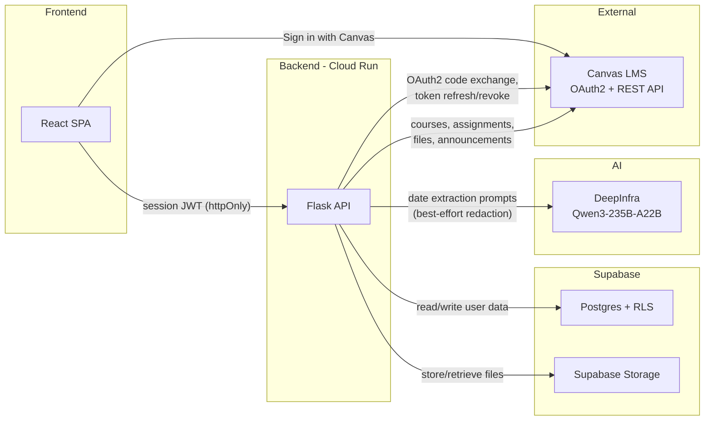

# CanvasSync

A full-stack web application that unifies Canvas LMS assignments with
AI-extracted deadlines from syllabi, modules, and course documents into a single
weekly and calendar view.

## The Problem

Canvas LMS scatters deadline information across multiple surfaces:

- **Assignments tab** only shows items the instructor explicitly created as
  Canvas assignments.
- **Syllabus PDFs**, schedule spreadsheets, and other uploaded files often
  contain additional due dates that never appear in the assignments list.
- **Module pages**, front pages, and announcements may reference deadlines in
  unstructured text.

Students end up checking multiple places per course and still miss work that was
only mentioned in a document. Canvas has no native way to consolidate all of
these sources into one timeline.

## Key Features

- **Canvas OAuth2 sign-in** — users connect their own Canvas account via OAuth2;
  access/refresh tokens are encrypted at rest and refreshed automatically.
- **AI-powered date extraction** — sends relevant course text, after best-effort
  redaction of obvious identifiers, directly to DeepInfra using
  `Qwen/Qwen3-235B-A22B-Instruct-2507`. Course text is not guaranteed anonymous. Independent course
  groups resolve in parallel (default up to 10 concurrent LLM calls);
  lecture/lab/recitation sections with the same class code share one merged
  resolve pass.
- **Unified weekly and calendar views** — all assignments from all synced courses
  in one timeline, whether from the Canvas API or AI-discovered from documents.
- **Completion tracking** — combines Canvas submission state with a manual
  checklist.
- **Privacy controls** — explicit legal consent before ingestion, plus in-app
  data export and full data deletion.
- **Dark-themed responsive UI** — React + Tailwind CSS.

## Architecture


```mermaid
flowchart LR
    subgraph client [Frontend]
        React["React SPA"]
    end

    subgraph backend [Backend - Cloud Run]
        Flask["Flask API"]
    end

    subgraph supa [Supabase]
        Postgres["Postgres + RLS"]
        Storage["Supabase Storage"]
    end

    subgraph ai [AI]
        DeepInfra["DeepInfra\nQwen3-235B-A22B"]
    end

    subgraph external [External]
        Canvas["Canvas LMS\nOAuth2 + REST API"]
    end

    React -->|"session JWT (httpOnly)"| Flask
    React -->|"Sign in with Canvas"| Canvas
    Flask -->|"OAuth2 code exchange,\ntoken refresh/revoke"| Canvas
    Flask -->|"courses, assignments,\nfiles, announcements"| Canvas
    Flask -->|"read/write user data"| Postgres
    Flask -->|"store/retrieve files"| Storage
    Flask -->|"date extraction prompts\n(best-effort redaction)"| DeepInfra
```

**Request flow:** The React frontend starts the Canvas OAuth2 flow. The Flask
backend exchanges the authorization code for Canvas tokens, encrypts them
(Fernet) and stores them in Supabase, then issues its own httpOnly session JWT.
On each request the backend validates the session, refreshes the Canvas token if
needed, syncs data from the Canvas REST API into Supabase, and (after the user
has consented) sends relevant course text directly to DeepInfra for date
extraction. No AI gateway or alternate-provider fallback is configured;
best-effort redaction runs before the request, but free-text course materials
are not guaranteed anonymous.
Multi-course syncs run independent class-code groups in parallel
(`AI_MAX_CONCURRENCY`, default 10); sections with the same course code (e.g.
lecture + lab) stay grouped in a single LLM call and results fan out to each
Canvas shell.

## AI date resolution

When resolving deadlines (`POST /api/resolve_course_dates`):

1. **Group by class code** — courses sharing a normalized class code (lecture,
   lab, recitation) are one work item with merged assignments, files, and
   announcements (deduped across sections).
2. **Parallel across groups** — up to `AI_MAX_CONCURRENCY` independent groups
   run concurrently (default **10**). Total sync time stays closer to one LLM
   wave instead of sequential per-course calls.
3. **Fan out saves** — one LLM response updates all section shells in the
   group; discovered items are written to every relevant course ID.
4. **Partial failure** — a failed group does not abort the sync; successful
   groups persist immediately. The API returns per-group and per-course status.

The provider and model are fixed to direct DeepInfra and
`Qwen/Qwen3-235B-A22B-Instruct-2507`. If that request fails, the app reports the
failure instead of silently using another provider or model.

Relevant env vars (see `backend/.env.template`): `DEEPINFRA_API_KEY`,
`LLM_BASE_URL`, `MODEL_NAME`, `AI_MAX_CONCURRENCY`, and
`AI_TRANSIENT_MAX_RETRIES`.

## Runtime modes

Mode is determined by `backend/app_config.py` (the single source of truth):

- **Cloud mode** (`APP_ENV=production`, or `CLOUD_MODE=true`): Supabase + Canvas
  OAuth + enforced authentication. The only supported production mode.
- **Local mode** (development default): single-user SQLite with **no auth** — for
  development only. The app **fails closed** and refuses to start in this mode
  when `APP_ENV=production`.

## Tech Stack

| Layer | Technologies |
|---|---|
| **Frontend** | React 19, Tailwind CSS, Day.js |
| **Backend** | Python 3.11, Flask 3, Gunicorn, Flask-Limiter |
| **Database** | Supabase (Postgres + RLS) — cloud; SQLite — local dev |
| **AI** | Direct DeepInfra (`Qwen/Qwen3-235B-A22B-Instruct-2507`) |
| **Storage** | Supabase Storage (local filesystem fallback in dev) |
| **Auth** | Canvas OAuth2; httpOnly session JWTs; Fernet-encrypted Canvas tokens |
| **Parsing** | pdfplumber, python-docx, openpyxl, BeautifulSoup |
| **Infrastructure** | Google Cloud Run, Docker; frontend on Vercel |

## Project Structure

```
canvas-organizer/
├── backend/
│   ├── app.py                  # Flask application and API routes
│   ├── app_config.py           # Environment/mode detection (fail-closed)
│   ├── auth.py                 # Canvas OAuth2, session JWTs, secret validation
│   ├── canvas_token_service.py # Canvas token refresh/revoke lifecycle
│   ├── db_supabase.py          # Supabase data access layer
│   ├── db.py                   # SQLite data access layer (local dev mode)
│   ├── retention_service.py    # Data retention enforcement
│   ├── sync_throttle.py        # Distributed per-user sync spacing
│   ├── storage.py              # Supabase Storage / local file storage
│   ├── ai/
│   │   ├── llm_model.py              # Direct DeepInfra LLM integration
│   │   ├── parallel_course_resolve.py # Bounded parallel resolve across course groups
│   │   └── prompt_sanitizer.py       # Best-effort PII redaction before LLM calls
│   ├── parsers/                # PDF/DOCX/file extraction + safe download
│   ├── migrations/             # SQL + data-repair migrations
│   ├── requirements.txt
│   ├── Dockerfile
│   └── .env.template
├── frontend/
│   ├── src/
│   │   ├── App.js              # Main application (views, state, UI)
│   │   ├── auth.js             # Canvas OAuth session handling
│   │   ├── api.js              # API client
│   │   └── pages/, components/ # Legal pages, consent modal, etc.
│   └── .env.template
├── docs/                       # Audit, compliance, ops runbook, OIT package
└── SECURITY.md
```

## Getting Started

### Prerequisites

- Python 3.11+, Node.js + npm
- For cloud mode: a Supabase project, a DeepInfra API key, and a Canvas
  Developer Key (OAuth2 client id/secret) for your institution's Canvas instance.

### Local Development

Local mode runs with SQLite and no authentication (development only).

**Backend:**

```bash
cd backend
cp .env.template .env
# Leave APP_ENV unset (defaults to development). CLOUD_MODE defaults to false.

python -m venv venv
source venv/bin/activate   # On Windows: venv\Scripts\activate
pip install -r requirements.txt

python app.py
```

The backend starts on `http://localhost:5000`.

**Frontend:**

```bash
cd frontend
cp .env.template .env.local   # sets REACT_APP_API_URL=http://localhost:5000
npm install
npm start
```

### Cloud Deployment

The backend targets Google Cloud Run. See `docs/OPS_RUNBOOK.md` for the full
configuration matrix, secret rotation, retention, and incident response.

```bash
cd backend
docker build -t canvassync-backend .
```

Generate a Fernet encryption key for `CANVAS_TOKEN_ENCRYPTION_KEY`:

```bash
python -c "from cryptography.fernet import Fernet; print(Fernet.generate_key().decode())"
```

In production the backend **fails closed** unless all required configuration is
present (see `validate_production_secrets` in `backend/auth.py` and the table in
`docs/OPS_RUNBOOK.md`): `APP_ENV`, `SESSION_SECRET_KEY`,
`CANVAS_TOKEN_ENCRYPTION_KEY`, `SUPABASE_URL`, `SUPABASE_SERVICE_KEY`,
`CANVAS_OAUTH_CLIENT_ID/SECRET/REDIRECT_URI`, `FRONTEND_URL`, and
`RATELIMIT_STORAGE_URI` (distributed store).

## Security & Privacy

See [SECURITY.md](SECURITY.md) and `docs/OIT_READINESS_AUDIT.md`. Key points:

- **Canvas tokens encrypted at rest** with Fernet before storage in Supabase.
- **Stable account-scoped data keys** (never derived from rotating tokens).
- **Consent enforced at ingestion** — Canvas data is not stored until the user
  has accepted the ToS / Privacy / AI disclosure.
- **Direct, disclosed AI route** — data is sent only to DeepInfra using the
  configured Qwen model; best-effort PII redaction runs first.
- **Data minimization & retention** — raw Canvas payloads are not persisted in
  production by default; time-based retention purges stored content.
- **User data controls** — in-app export and full deletion (revokes Canvas
  tokens and erases stored rows).
- **SSRF protection** — Canvas hosts validated against an allowlist.
- **Distributed rate limiting** — per-user sync spacing and hourly caps held in
  a shared store across autoscaled instances.
