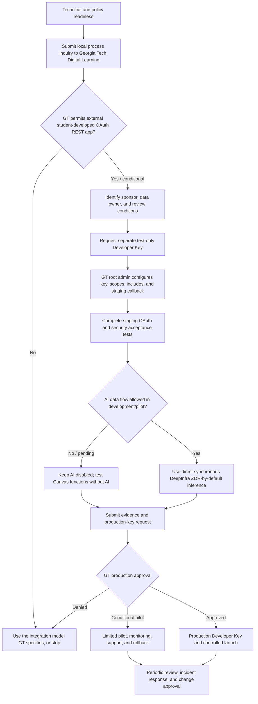

# CanvasSync Georgia Tech Canvas OAuth Compliance and Approval Map

**Prepared:** June 20, 2026
**Project contact:** `pablo3@gatech.edu`
**Application type:** Independent Georgia Tech student-developed external web application
**Requested integration:** Georgia Tech Canvas OAuth2 REST API Developer Key
**Not requested:** Global Instructure partner approval, marketplace listing, or LTI certification

> This is a technical and policy-alignment document, not legal advice and not a
> substitute for a written decision from Georgia Tech Digital Learning.

## 1. Executive conclusion

The approval authority for CanvasSync's OAuth credential is **Georgia Tech's
local Canvas root-account administration**, not Instructure's global partner or
certification program.

Instructure defines the OAuth/API mechanism and policy. Its administrator
documentation places creation, scoping, enablement, and revocation of Developer
API Keys in the institution's Canvas root account. Georgia Tech's Digital
Learning Team oversees academic platforms and tools and publishes
`canvas@gatech.edu` as its Canvas contact.

CanvasSync is not an LTI tool. Georgia Tech's published January 1, 2026
certification requirement expressly applies to new third-party tools integrated
through LTI. Therefore, based on the public material:

- CanvasSync does not currently need global 1EdTech/LTI certification;
- CanvasSync does not need a global Instructure marketplace or partner approval;
- Georgia Tech must still decide whether to issue a local Developer Key;
- Georgia Tech may impose local security, privacy, accessibility, support,
  sponsorship, pilot, and AI conditions;
- no public Georgia Tech page specifies the complete standalone OAuth
  Developer Key workflow or guarantees a student-app exemption.

The appropriate first submission is a **local development-key and process
request**, followed by a separate production-key request after testing.

## 2. What student-developed status changes

CanvasSync should consistently be described as:

> An independent Georgia Tech student-developed application for authorized
> academic planning. It is not an official, sponsored, or endorsed Georgia Tech
> or Instructure service.

### Likely effect

Student-developed status materially distinguishes CanvasSync from:

- a purchased enterprise vendor product;
- an Institute-operated production service;
- a third-party LTI installed into Canvas navigation or courses;
- an Instructure marketplace integration.

This supports asking for a narrower local development or limited-pilot review.
For example, procurement, institutional contracting, 1EdTech certification, and
the LTI three-month course-deployment process may not apply in their enterprise
form.

### What it does not automatically waive

No public Georgia Tech source found establishes that a student-developed app may
receive a Canvas Developer Key without local review. Student status does not
itself authorize:

- creation of a key in Georgia Tech's Canvas root account;
- access to other students' educational records;
- use of Georgia Tech branding or statements implying endorsement;
- sending Canvas course content to external infrastructure or AI providers;
- bypassing Georgia Tech security, privacy, accessibility, or acceptable-use
  requirements;
- deployment of an LTI tool without the published LTI process.

The exact lighter-weight path, if available, must be confirmed in writing by
Digital Learning.

## 3. Authority and responsibility map

| Decision or responsibility | Owner |
| --- | --- |
| OAuth/API technical rules | Instructure Canvas documentation and API Policy |
| Create, configure, enable, disable, or revoke the Developer Key | Georgia Tech local Canvas root administrator |
| Identify the local review path | Georgia Tech Digital Learning Team |
| Decide whether student sponsorship/data ownership is needed | Georgia Tech |
| Application implementation and truthful disclosures | CanvasSync student developer |
| DeepInfra account, key, model, and request configuration | CanvasSync student developer |
| Decide whether the proposed Canvas-to-DeepInfra data flow is acceptable for the local key/pilot | Georgia Tech |
| End-user authorization | Each user through Canvas OAuth consent |
| Ongoing key compliance and incident response | CanvasSync operator plus Georgia Tech's right to disable the key |

Primary local contact: `canvas@gatech.edu`.

## 4. Approval-process map



## 5. Stage 0 — Technical and documentary readiness

**Owner:** CanvasSync developer
**Purpose:** Do not ask Georgia Tech to approve claims that the implementation
does not support.

Required evidence:

- current architecture accurately identifies Vercel, Google Cloud Run,
  Supabase, Canvas, and direct DeepInfra;
- OpenRouter and retired endpoints are absent from the active runtime;
- public Terms, Privacy Policy, and consent text match code and deployment;
- contact email is `pablo3@gatech.edu`;
- no user is asked to paste a personal Canvas token;
- Canvas credentials remain server-side and encrypted;
- signed OAuth state is implemented;
- application session is not placed in the redirect URL;
- unsafe cookie-authenticated requests have CSRF protection;
- legal consent is versioned and stored before Canvas ingestion;
- direct browser database roles are denied using RLS;
- raw Canvas payload persistence is disabled;
- retention, export, disconnect, and deletion controls exist;
- DeepInfra is pinned to the approved direct base URL and exact model;
- no provider/model fallback exists;
- security limitations are disclosed honestly.

### Current technical state as of this document

- Deprecated Supabase demo/application rows were cleared.
- Consolidated migration `backend/migrations/010_compliance_state.sql` is
  prepared to add consent/session columns, enforce deny-direct RLS policies,
  create retention indexes, and remove the obsolete empty AI telemetry table.
- The Supabase dashboard was awaiting final destructive-query confirmation when
  this document was prepared.
- CSRF and deletion/revocation reliability fixes are implemented in the current
  worktree but are not production facts until deployed and verified.
- A dedicated DeepInfra key is stored in Google Secret Manager.
- A live synchronous call to
  `https://api.deepinfra.com/v1/openai/chat/completions` succeeded with
  `Qwen/Qwen3-235B-A22B-Instruct-2507`.
- Georgia Tech OAuth credentials remain placeholders, so the deployed login
  correctly fails closed.

**Exit gate:** All applicable changes are deployed and the verification report
contains no unresolved technical misstatement.

## 6. Stage 1 — Local process inquiry

**Owner:** CanvasSync developer
**Recipient:** Georgia Tech Digital Learning, `canvas@gatech.edu`

The inquiry should ask:

1. May an independent Georgia Tech student-developed external application use a
   local Canvas OAuth REST Developer Key?
2. Is there a streamlined student-development or limited-pilot process?
3. Does the published LTI process apply even though CanvasSync has no LTI launch
   or Canvas placement?
4. Is a faculty/staff sponsor, department, or institutional data owner required?
5. Which security, privacy, accessibility, brand, support, and continuity
   evidence is required?
6. May Georgia Tech issue a test-only key before production review?
7. Under what conditions may the app use direct DeepInfra date extraction?

The inquiry should explicitly state:

- the request is local to Georgia Tech's Canvas root account;
- no global Instructure or 1EdTech approval is being requested;
- the first request is for development/test access, not a general launch;
- AI can remain disabled if GT wants to evaluate OAuth separately;
- CanvasSync is independent and student-developed.

**Exit gate:** Written response naming the applicable path, responsible contact,
and conditions.

## 7. Stage 2 — Test-only Developer Key

**Owner:** Georgia Tech local Canvas root administrator
**Environment:** Separate staging environment

Recommended key configuration:

- separate development key;
- `test_cluster_only=true`;
- `require_scopes=true`;
- `allow_includes=true`;
- `auto_expire_tokens=true`;
- monitored owner email `pablo3@gatech.edu`;
- exact staging HTTPS callback;
- only approved read-only scopes;
- disabled outside the approved test/beta environment.

Requested scopes:

```text
url:GET|/api/v1/users/self
url:GET|/api/v1/courses
url:GET|/api/v1/courses/:id
url:GET|/api/v1/courses/:course_id/assignments
url:GET|/api/v1/courses/:course_id/files
url:GET|/api/v1/files/:id
url:GET|/api/v1/courses/:course_id/modules
url:GET|/api/v1/courses/:course_id/front_page
url:GET|/api/v1/courses/:course_id/pages
url:GET|/api/v1/courses/:course_id/pages/:url_or_id
url:GET|/api/v1/announcements
```

`allow_includes=true` is requested because the app uses documented includes for
current-user submission state, syllabus body, module items, and course
state/date metadata.

Staging should use:

- separate Cloud Run service;
- separate Supabase project or isolated approved staging schema;
- separate encryption and session secrets;
- separate Vercel staging URL;
- development callback only;
- synthetic or specifically approved test data;
- AI disabled unless GT approves that portion of the test.

**Exit gate:** Key issued and configuration recorded.

## 8. Stage 3 — Development acceptance testing

**Owner:** CanvasSync developer, with results supplied to GT

Required tests:

### OAuth

- authorize and deny paths;
- exact callback matching;
- signed state mismatch and expiration;
- confirmation of whether GT Canvas accepts/enforces PKCE;
- token exchange;
- one-hour token expiry and refresh;
- disconnect/revocation;
- key disable/re-enable behavior;
- no token in URL, frontend storage, logs, or export.

### Scope behavior

- every requested endpoint succeeds with the approved key;
- denied/removed scopes disable the corresponding feature safely;
- no write operation to Canvas;
- Canvas 401, 403, 429, timeout, and partial-course failure behavior.

### Application security

- versioned consent before ingestion;
- re-consent after a policy-version change;
- CSRF rejection for untrusted origins and missing custom header;
- strict CORS;
- session invalidation;
- RLS denial using anon/authenticated database credentials;
- user-to-user data isolation;
- raw-payload minimization;
- export excludes credentials;
- deletion verifies storage cleanup;
- scheduled retention;
- retired endpoints remain 404;
- no secret or course-content logging.

### AI, if GT allows it

- exact direct base URL;
- exact Qwen model;
- no OpenRouter;
- no alternate model/provider fallback;
- synchronous inference only, not the bulk API;
- prompt minimization and identifier redaction;
- AI labels and user warning;
- failure closes without silently switching providers.

**Exit gate:** Signed/dated staging evidence with all required tests passing.

## 9. Stage 4 — AI/data-flow decision

DeepInfra does not expose a separate special ZDR URL for this model. CanvasSync
uses the ordinary synchronous OpenAI-compatible endpoint:

```text
https://api.deepinfra.com/v1/openai/chat/completions
```

DeepInfra describes ordinary inference as **zero data retention by default**:

- inputs/outputs processed in memory;
- no disk storage after ordinary inference;
- no training on inference content;
- the bulk API is different and may temporarily store encrypted data;
- limited request logging may occur for debugging or security.

CanvasSync's controls:

- dedicated key in Google Secret Manager;
- exact model `Qwen/Qwen3-235B-A22B-Instruct-2507`;
- direct API only;
- no gateway;
- no fallback;
- no application prompt/completion telemetry table;
- prompt minimization, clipping, and best-effort identifier redaction;
- course text is not represented as guaranteed anonymous;
- AI output is labeled and must be verified against Canvas.

Georgia Tech's public AI guidance says technology integrated with Institute
systems may require risk, privacy, security, data-stewardship, and related
review. It does not publicly state whether the full enterprise process applies
unchanged to this independent student-developed pilot. Digital Learning must
state the applicable local condition.

Possible decisions:

- AI permitted for test and pilot;
- OAuth permitted but AI must remain disabled;
- AI permitted only with restricted/synthetic data;
- additional review or agreement required;
- different provider/data-flow required.

**Exit gate:** Written GT decision or AI remains disabled.

## 10. Stage 5 — Production Developer Key request

**Owner:** CanvasSync developer submits; GT local Canvas administrator decides

Submission package:

- GT's written development-path decision;
- completed scope-to-feature matrix;
- staging OAuth results;
- CSRF/RLS/isolation/deletion/retention evidence;
- current architecture and data-flow diagram;
- current Terms, Privacy Policy, and consent screenshots/URLs;
- DeepInfra ZDR-by-default documentation and reserved exception;
- incident, support, continuity, and key-disable plan;
- accessibility findings requested by GT;
- pilot population and timeline;
- exact production callback URI;
- confirmation that no inactive/future custom domain is used.

Recommended production-key configuration:

- separate production key;
- `test_cluster_only=false`;
- `require_scopes=true`;
- `allow_includes=true`;
- `auto_expire_tokens=true`;
- approved read-only scopes only;
- exact production callback;
- monitored owner email;
- initially disabled until coordinated cutover;
- documented GT-side emergency disable procedure.

**Exit gate:** Written production approval and enabled key.

## 11. Stage 6 — Limited pilot

Unless GT expressly authorizes a general launch, begin with a limited pilot.

Pilot controls:

- approved user cohort;
- clear student-developed/non-endorsed notice;
- support contact `pablo3@gatech.edu`;
- incident contact and escalation path;
- monitoring for Canvas 401/403/429 and abnormal sync volume;
- retention job monitoring;
- user export, disconnect, and deletion support;
- no provider, model, scope, data-category, or retention expansion without
  review;
- GT can disable the key immediately;
- rollback to AI-disabled mode independently of OAuth.

**Exit gate:** GT accepts pilot evidence and authorizes continuation/expansion.

## 12. Ongoing obligations

- Keep the Developer Key owner and contact current.
- Use only approved scopes, callbacks, instance, and purposes.
- Do not ask users for personal access tokens.
- Protect and rotate OAuth, session, encryption, Supabase, and DeepInfra keys.
- Maintain actual notice and affirmative re-consent for materially more
  permissive data practices.
- Keep policies synchronized with runtime behavior.
- Keep AI provider/model and ZDR disclosure accurate.
- Monitor Canvas API limits and back off appropriately.
- Maintain retention, export, disconnect, deletion, and incident procedures.
- Report material security or data incidents through the GT path supplied during
  approval.
- Obtain GT approval before converting the application to LTI or adding a Canvas
  placement.
- Reconfirm conditions before a general launch, institutional adoption, GT App
  listing, transfer to a department, or change in operator.

## 13. Hard blockers versus conditional items

### Hard blockers before any real-user OAuth pilot

- no locally issued Georgia Tech Developer Key;
- no real GT OAuth end-to-end test;
- inaccurate or aspirational public policy statements;
- missing consent/session database migration;
- missing CSRF protection in the deployed backend/frontend;
- inability to verify user isolation, deletion, and token lifecycle.

### Conditional on Georgia Tech's answer

- faculty/staff sponsor;
- formal data owner;
- HECVAT or third-party review depth;
- accessibility artifact;
- brand review;
- whether AI may be active;
- whether a separate institutional agreement with DeepInfra is required;
- pilot size;
- whether a shared Redis endpoint limiter is required before the pilot;
- production support and continuity requirements.

### Not applicable unless the architecture changes

- 1EdTech LTI certification;
- LTI 1.3 registration;
- Canvas course-navigation/module/assignment placement review;
- global Instructure marketplace approval.

These become applicable if CanvasSync is converted into an LTI or embedded
Canvas tool.

## 14. Readiness conclusion

### Ready now

- Send a local process inquiry to `canvas@gatech.edu`.
- Present CanvasSync as independent and Georgia Tech student-developed.
- Request a test-only Developer Key and ask for the streamlined student path.
- Explain that this is a local GT root-account decision, not global Instructure
  certification.

### Not ready until final remediation/deployment verification

- Claim that the current production site has all database/security fixes live.
- Begin a real-user pilot.
- Request unconditional general-production approval.

### Ready after Stage 0 is deployed

Once migration 010 is applied, the current worktree is deployed, and live
verification passes, the development-key package is technically credible. The
remaining decision is institutional: Georgia Tech must identify the local
student-app process and issue the key.

## 15. Primary sources

- Georgia Tech Digital Learning, Contact Us:
  https://canvas.gatech.edu/contact-us/
- Georgia Tech Digital Learning, About Us:
  https://canvas.gatech.edu/about-us/
- Georgia Tech, Updated LTI Vetting Process, March 26, 2026:
  https://sites.gatech.edu/dlt-blog/2026/03/26/updated-lti-vetting-process/
- Georgia Tech OIT, AI Standards and Guidance:
  https://oit.gatech.edu/ai/guidance
- Georgia Tech, Third Party Security Procedures:
  https://security.gatech.edu/third-party-security-procedures/
- Georgia Tech, Services Security Checklist:
  https://security.gatech.edu/services-security-checklist/
- Georgia Tech, Personal Information Privacy Policy:
  https://policylibrary.gatech.edu/legal/personal-information-privacy-policy
- Georgia Tech, Use of Name Standards:
  https://brand.gatech.edu/our-look/use-of-name
- Instructure, Canvas OAuth2:
  https://developerdocs.instructure.com/services/canvas/oauth2/file.oauth
- Instructure, Developer Keys:
  https://developerdocs.instructure.com/services/canvas/resources/developer_keys
- Instructure, Canvas API Policy:
  https://www.instructure.com/policies/canvas-api-policy
- Instructure administrator guide, adding a Developer API Key:
  https://community.canvaslms.com/t5/Admin-Guide/How-do-I-add-a-developer-API-key-for-an-account/ta-p/259
- DeepInfra, Qwen model/API page:
  https://deepinfra.com/Qwen/Qwen3-235B-A22B-Instruct-2507
- DeepInfra, Data Privacy:
  https://docs.deepinfra.com/account/data-privacy
- DeepInfra, Terms and Privacy:
  https://deepinfra.com/terms
  https://deepinfra.com/privacy
