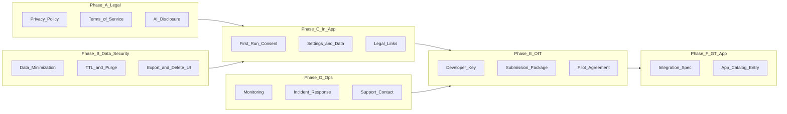

# GT OIT Approval Plan — CanvasSync

**Goal:** Close remaining gaps so CanvasSync is approvable for a **limited GT pilot** and eventual **GT App** integration.

**Prerequisite (done):** Security audit remediation (`db9fbb7`), RLS migration `002_fix_rls.sql` applied in Supabase.

**Related docs:** [INSTITUTIONAL_COMPLIANCE.md](./INSTITUTIONAL_COMPLIANCE.md) · [CANVAS_TOS_COMPLIANCE.md](./CANVAS_TOS_COMPLIANCE.md) · [SECURITY_ROADMAP.md](./SECURITY_ROADMAP.md)

---

## Success criteria (what “approved” looks like)

| Gate | Evidence OIT expects |
|------|---------------------|
| Canvas OAuth developer key registered | Approved key + scoped permissions on `gatech.instructure.com` |
| Privacy & terms published | Public URLs linked in app and submission |
| Data use documented & minimized | Written data inventory + code that enforces retention |
| AI transparency | In-app consent + OpenRouter ZDR/no-logging guarantees + content de-identification |
| Security verified | Signed-off prod acceptance tests + incident contact |
| Pilot proposal | Scope, duration, student count, rollback plan |
| GT App path | Integration spec (link-out vs embedded; auth model) |

---

## Overview (phases)



**Suggested timeline:** 2–3 weeks focused work before first OIT meeting; pilot 4–6 weeks after key approval.

---

## Phase A — Legal & policy (no code required, blocks approval)

### A1. Privacy Policy (public page)

**Deliverable:** `https://canvassync.app/privacy` (or `/privacy` route in SPA)

**Must include:**

| Section | Content |
|---------|---------|
| Who we are | Student-built tool; maintainer name + GT affiliation + contact email |
| What we collect | Email, name (from Canvas OAuth); course names/codes; assignment titles/dates; syllabus/module text extracts; announcements (title/body); encrypted OAuth tokens |
| What we do **not** collect | Grades, submissions, quiz answers, financial info, SSN |
| Why | Calendar aggregation and **AI date inference** (core product) |
| Third parties | Supabase (DB), Google Cloud Run (API), Vercel (frontend), **OpenRouter** (primary AI), DeepInfra (fallback only if ZDR-equivalent) — link to their privacy pages |
| Retention | Default TTLs (see Phase B); delete on user request or account removal |
| User rights | Delete all data (`POST /api/user/delete-data`); how to contact for questions |
| FERPA framing | Tool is for student convenience; not an official GT system; students opt in |
| Changes | “Last updated” date + notice mechanism |

**Acceptance:** URL live; linked from app footer and OIT submission.

---

### A2. Terms of Service (public page)

**Deliverable:** `https://canvassync.app/terms`

**Must include:**

- Service provided “as-is” for enrolled GT students during pilot
- Acceptable use (no scraping beyond personal sync; no sharing credentials)
- Canvas API Policy compliance statement
- Limitation of liability
- Termination (OIT or maintainer can revoke access)
- Governing law / GT student code of conduct reference

**Acceptance:** URL live; checkbox on first-run consent references ToS + Privacy.

---

### A3. AI subprocessor addendum (required — AI is core)

**Deliverable:** `docs/OPENROUTER_PRIVACY.md` + section in Privacy Policy + OIT one-pager

**Position for OIT:** CanvasSync’s value is AI-assisted due-date extraction. Privacy is achieved by **(1) not sending student identity to the LLM**, **(2) OpenRouter’s default no-retention + ZDR routing**, and **(3) scrubbing incidental PII from course text before the API call**.

#### What OpenRouter guarantees (verify account settings)

Per [OpenRouter data collection](https://openrouter.ai/docs/guides/privacy/data-collection) and [ZDR](https://openrouter.ai/docs/guides/features/zdr):

| Layer | Default / control | CanvasSync action |
|-------|-------------------|-------------------|
| Prompt/response storage | **Off** unless you opt into “Private Input & Output Logging” | Confirm logging **disabled** in [Observability](https://openrouter.ai/workspaces/default/observability) |
| Training on prompts | **Off** unless opted in | Disable “use inputs/outputs to improve product” in [Privacy settings](https://openrouter.ai/settings/privacy) |
| OpenRouter retention | ZDR policy — prompts not retained unless logging opt-in | Document in privacy policy |
| Anonymous categorization | Small sample; **not linked to account** if improvement opt-in is off | Cite in OIT pack |
| Metadata only | Token counts, latency (no prompt body) | Acceptable for billing; no student ID sent |
| Downstream model host | Varies by endpoint | Enforce **`provider.zdr: true`** per request + only route to ZDR endpoints |
| Secondary fallback provider | TBD | **Action item** — not disclosed to users until documented; `OPENROUTER_ALLOW_FALLBACK=false` in prod |

**Account checklist (do before pilot):**

- [ ] Private Input & Output Logging = **OFF**
- [ ] OpenRouter use of inputs/outputs for product improvement = **OFF**
- [ ] Account-wide “ZDR only” or per-request `zdr: true` enabled
- [ ] Paid-model “do not train on my data” routing enabled
- [ ] Confirm `qwen/qwen3.5-flash-02-23` is eligible under ZDR via [ZDR endpoints API](https://openrouter.ai/api/v1/endpoints/zdr)

#### What CanvasSync already does well

- Prompts contain **course codes, assignment titles, syllabus/module text** — not student email, Canvas user id, or JWT.
- Telemetry stores **token counts only** (`AI_LOG_MAX_PROMPT_CHARS=0`); no prompt/response persistence in Supabase.

#### What CanvasSync must add (content de-identification)

Syllabus PDFs often contain **instructor names, emails, GT IDs, office hours** — not linked to the requesting student, but still PII in the payload. OIT may treat this as “not anonymous” even if OpenRouter doesn’t store it.

**Code tasks (Phase B6):**

1. **`backend/ai/prompt_sanitizer.py`** — Redact before `_call_llm`:
   - Email addresses → `[EMAIL]`
   - GT IDs / 9-digit numbers → `[ID]`
   - Phone numbers → `[PHONE]`
   - Optional: student name patterns if ever added to prompt
2. **`backend/ai/llm_model.py`** — Run sanitizer on all file text + announcement bodies.
3. **`backend/ai/llm_model.py`** — Pass OpenRouter privacy params on every call (see B6).
4. **Never** send `user`, `user_id`, or session metadata in OpenRouter request bodies.

**In-app consent (Phase C):** Explain that AI processing uses de-identified course materials via OpenRouter with zero prompt retention, not that AI is optional.

---

## Phase B — Data security & minimization (code + DB)

OIT will ask *“why do you store X?”* — implement minimization in code, not only in docs.

### B1. Data inventory (document + enforce)

**Deliverable:** `docs/DATA_INVENTORY.md`

| Table / field | Needed for calendar? | Action |
|---------------|---------------------|--------|
| `assignments.name`, `normalized_due_at`, `category` | Yes | Keep |
| `assignments.description` | Partial | Truncate to N chars or drop after AI resolve |
| `assignments.raw_canvas_json` | Debug only | **Stop writing in production** or purge after 7 days |
| `course_file_texts.extracted_text` | Yes (AI + display) | TTL purge (see B2) |
| `announcements.message` | Yes (date inference) | TTL purge with file texts |
| `announcements.raw_json` | No | Stop storing |
| `ai_usage_logs` | Ops only | Keep metadata only; disabled in prod by default |
| OAuth tokens | Yes | Already encrypted; revoke on logout/delete |

**Code tasks:**

1. **`backend/app.py`** — Gate `raw_canvas_json` writes behind `STORE_RAW_CANVAS_JSON=false` (default off in prod).
2. **`backend/app.py`** — Stop persisting `announcements.raw_json` (or same env gate).
3. **`backend/db_supabase.py`** — Add `purge_stale_user_content(user_id=None)` for TTL enforcement.

**Acceptance:** Production env has `STORE_RAW_CANVAS_JSON=false`; DB row count for raw JSON stable or shrinking.

---

### B2. Automated retention (TTL)

**Env vars:**

```bash
COURSE_FILE_TEXT_RETENTION_DAYS=90      # syllabus/module extracts
ANNOUNCEMENT_RETENTION_DAYS=90
INACTIVE_USER_PURGE_DAYS=365            # optional: no login + no sync
```

**Code tasks:**

1. **`backend/retention_service.py`** (new) — Delete rows older than TTL per user/course.
2. **`backend/app.py`** — `POST /api/admin/retention-run` (cron-only, shared secret or Cloud Scheduler OIDC) **or** Cloud Run Job on schedule.
3. **`backend/migrations/003_retention_indexes.sql`** — Index on `created_at` / `synced_at` for efficient purge.

**Acceptance:** Cron runs weekly; logs show rows deleted; privacy policy matches TTL values.

---

### B3. User data controls (API already partial)

| Endpoint | Status | Enhancement |
|----------|--------|-------------|
| `POST /api/user/delete-data` | Exists | Clear session cookie in response; require confirmation token |
| `GET /api/user/data-export` | **New** | JSON export of user's courses/assignments (OIT/FERPA goodwill) |
| Disconnect Canvas | Partial (logout revokes) | `POST /api/user/disconnect-canvas` without full account delete |

**Code tasks:**

1. Add export endpoint (rate-limited, `@require_auth`).
2. Add disconnect endpoint (revoke token, keep user prefs row or anonymize).
3. **`backend/auth.py`** — On delete-data, also `clear_session_cookie`.

**Acceptance:** Student can export and delete all data from Settings without emailing support.

---

### B4. AI consent (required, not opt-out of core feature)

AI remains **on** after consent. Consent documents *what* is sent and *how* OpenRouter handles it.

**Env / DB:**

```bash
ENABLE_AI_RESOLVE=true          # must stay true in production
OPENROUTER_ENFORCE_ZDR=true     # per-request ZDR routing
OPENROUTER_ALLOW_TRAINING=false   # require no-training providers
OPENROUTER_ALLOW_FALLBACK=false   # action item: document fallback provider before enabling
```

**Code tasks:**

1. Migration `004_user_ai_consent.sql` — `ai_consent_at` (required before first sync).
2. **`backend/app.py`** — Block sync AI step until `ai_consent_at` is set.
3. Consent copy references OpenRouter ZDR + de-identified course text.

**Acceptance:** No LLM call without recorded consent; every LLM call uses ZDR + sanitizer.

---

### B6. OpenRouter API hardening (implement in code)

**File:** `backend/ai/llm_model.py` — extend `_call_llm` `extra_body`:

```python
extra_body={
    "reasoning": {"effort": "none"},
    "provider": {
        "zdr": True,
        "data_collection": "deny",  # if supported for your SDK path
        "require_parameters": True,
    },
}
```

Also set OpenRouter-recommended headers (no PII):

```python
# default_headers on OpenAI client
"HTTP-Referer": "https://canvassync.app",
"X-Title": "CanvasSync",
# Do NOT set user-identifying headers
```

**Verification tasks:**

1. Capture one prod request (dev tools / log redacted) — confirm no `user_id` in body.
2. Call OpenRouter with ZDR on — confirm routing does not fall back to non-ZDR endpoint (handle 4xx explicitly).
3. Document in `docs/OPENROUTER_PRIVACY.md` with screenshots of account privacy settings.

**Acceptance:** OIT packet includes OpenRouter policy links + account checklist signed + sample redacted prompt structure.

---

### B5. Production security hardening (remaining)

| Task | File / config | Priority |
|------|---------------|----------|
| Redis rate limits in prod | `RATELIMIT_STORAGE_URI` | High |
| Remove legacy localStorage token reads | `frontend/src/auth.js` | Medium |
| Prod acceptance test log | `docs/PROD_VERIFICATION.md` | High |
| Secret rotation runbook | `docs/OPS_RUNBOOK.md` | Medium |
| Dependabot / npm audit in CI | `.github/workflows/security.yml` | Low |

**Acceptance:** All items in [INSTITUTIONAL_COMPLIANCE.md](./INSTITUTIONAL_COMPLIANCE.md) acceptance tests signed off with dates.

---

## Phase C — In-app UX (trust & consent)

### C1. First-run consent flow

**When:** After successful Canvas OAuth, before first sync.

**UI components** (e.g. `frontend/src/components/ConsentModal.js`):

- [ ] Checkbox: “I agree to the [Terms] and [Privacy Policy]”
- [ ] Plain-language summary of data use (3 bullets)
- [ ] AI toggle: “Use AI to estimate missing due dates” (default **off** for pilot)
- [ ] Link to full privacy policy
- [ ] “Continue” → `PUT /api/user/preferences` with `aiConsentAt`, `aiResolveEnabled`

**Acceptance:** No sync/AI calls until consent recorded server-side.

---

### C2. Settings → Privacy & data

**Sections:**

| Action | Behavior |
|--------|----------|
| Export my data | Download JSON |
| Delete all my data | Confirm dialog → `POST /api/user/delete-data` → logout |
| Disconnect Canvas | Revoke token, keep account |
| AI date resolution | Toggle (mirrors consent) |

**Acceptance:** Matches privacy policy promises without support ticket.

---

### C3. Footer & marketing alignment

- Footer on all pages: Privacy · Terms · Contact (`privacy@canvassync.app` or GT email)
- Landing page: remove any implication of official GT endorsement until approved
- Add “Pilot — not an official Georgia Tech service” banner during pilot

---

## Phase D — Operational readiness

### D1. Support & ownership

| Item | Value |
|------|-------|
| Primary contact | Your GT email |
| Backup contact | Faculty advisor or co-maintainer |
| Response SLA (pilot) | 48h business days |
| Issue tracker | GitHub Issues private or GT ticketing if provided |

**Deliverable:** `docs/OPS_RUNBOOK.md` — deploy, rollback, secret rotation, on-call.

---

### D2. Incident response

**Deliverable:** `docs/INCIDENT_RESPONSE.md`

| Severity | Example | Action |
|----------|---------|--------|
| S1 | Token leak / DB exposure | Rotate secrets, notify OIT within 24h |
| S2 | Canvas API abuse | Disable sync, rate limit |
| S3 | AI vendor breach | Disable `ENABLE_AI_RESOLVE`, notify users |

**Acceptance:** OIT sees named contact and 24h notification commitment for data incidents.

---

### D3. Monitoring

| Signal | Tool |
|--------|------|
| API 5xx rate | Cloud Run metrics |
| Auth failures spike | Log-based alert |
| Canvas 401 rate | Custom metric (token refresh failures) |
| Sync volume per user | Existing rate limit tables |

**Acceptance:** One dashboard link or screenshot in OIT package.

---

## Phase E — OIT submission package

### E1. Developer key request

**Prepare before email:**

| Field | CanvasSync value |
|-------|------------------|
| App name | CanvasSync |
| Redirect URI | `https://<prod-api>/api/auth/canvas/callback` |
| Scopes | Minimum read-only (see below) |
| Icon / description | Student calendar from syllabus + Canvas |

**Recommended OAuth scopes (minimum):**

```
url:GET|/api/v1/courses
url:GET|/api/v1/courses/:course_id/assignments
url:GET|/api/v1/courses/:course_id/modules
url:GET|/api/v1/courses/:course_id/files
url:GET|/api/v1/courses/:course_id/discussion_topics
url:GET|/api/v1/users/self
```

**Do not request** write scopes, admin, or submission endpoints.

**Deliverable:** `docs/OIT_SUBMISSION.md` — copy-paste email + attachments list.

---

### E2. Submission attachments checklist

- [ ] Privacy Policy URL
- [ ] Terms URL
- [ ] Architecture diagram (browser → Cloud Run → Supabase; Canvas OAuth)
- [ ] Data inventory (`DATA_INVENTORY.md`)
- [ ] Security summary (`SECURITY_AUDIT.md` + remediation status)
- [ ] Canvas TOS compliance (`CANVAS_TOS_COMPLIANCE.md`)
- [ ] Prod verification results (`PROD_VERIFICATION.md`)
- [ ] Pilot proposal (below)
- [ ] AI subprocessor one-pager (or “AI disabled for v1” statement)

---

### E3. Pilot proposal template

| Field | Suggested |
|-------|-----------|
| Duration | 4 weeks |
| Audience | 50–100 volunteer students (one college) |
| Access | Direct URL or GT App link-out |
| AI | Disabled for v1 **or** opt-in only |
| Success metrics | Sync success rate, NPS, zero security incidents |
| Rollback | Revoke developer key; `ENABLE_DEMO_SESSION=false`; banner “pilot ended” |
| Faculty sponsor | Name + email (strengthens approval) |

---

## Phase F — GT App integration

**Start with link-out** (lowest friction); embedded WebView later if OIT prefers.

### F1. Integration options

| Model | Pros | Cons |
|-------|------|------|
| **A. External link** | No GT App code change; full OAuth in browser | Less native feel |
| **B. In-app browser** | Native shell | Cookie/OAuth redirect care needed |
| **C. Deep link return** | Return to GT App after OAuth | Requires GT App team coordination |

**Recommend:** Model A for pilot → B after approval.

### F2. GT App catalog entry

**Deliverable:** Short listing copy (title, description, category “Academics”, privacy URL, support email).

**Required from GT App team:**

- Listing approval workflow
- Branding guidelines (can you use “Georgia Tech” in name?)
- Analytics / telemetry rules

### F3. Auth model clarification for OIT

Document explicitly:

- CanvasSync uses **Canvas OAuth**, not GT SSO (BuzzCard)
- GT App may use GT SSO for its shell; CanvasSync session is separate
- No password storage; no GT credentials collected

---

## Phase G — Verification before OIT meeting

**Deliverable:** `docs/PROD_VERIFICATION.md`

| # | Test | Pass? | Date | Notes |
|---|------|-------|------|-------|
| 1 | OAuth login, no token in URL | | | |
| 2 | HttpOnly cookie session works cross-origin | | | |
| 3 | Canvas token refresh after 1h | | | |
| 4 | Logout revokes Canvas token | | | |
| 5 | delete-data removes Supabase rows | | | |
| 6 | RLS blocks anon SELECT on users | | | |
| 7 | Demo route 404 in prod | | | |
| 8 | LLM request uses ZDR + sanitized prompt (no email in body) | | | |
| 8b | OpenRouter account: logging & training opt-ins OFF | | | |
| 9 | Export returns user JSON only | | | |
| 10 | TTL job deletes stale file texts | | | |

---

## Implementation priority (ordered backlog)

### Sprint 1 — Approval blockers (1 week)

1. A1 + A2 — Publish Privacy + Terms pages
2. C1 — First-run consent modal
3. C3 — Footer legal links + pilot banner
4. B6 + A3 — OpenRouter ZDR in code + account checklist + `OPENROUTER_PRIVACY.md`
5. B4 — AI consent gate (required before first AI sync)
6. E2 — Draft OIT submission email + pilot proposal (lead with AI + privacy stack)
7. G — Run prod verification tests

### Sprint 2 — Data security depth (1 week)

7. B1 — Stop storing `raw_canvas_json` / `raw_json` in prod
8. B2 — Retention service + scheduled purge
9. B3 — Export + disconnect endpoints + Settings UI
10. D1 + D2 — Ops + incident docs

### Sprint 3 — OIT + GT App (ongoing)

11. E1 — Submit developer key request
12. F — GT App link-out + catalog copy
13. B5 — Redis rate limits, remove legacy token storage
14. Pilot launch + weekly check-ins with OIT contact

---

## Risk register

| Risk | Mitigation |
|------|------------|
| OIT questions third-party AI | Lead with OpenRouter ZDR + de-identified prompts; offer DeepInfra disabled until documented |
| Syllabus contains incidental PII | `prompt_sanitizer.py` + minimal announcement excerpt length |
| FERPA questions on syllabus text | TTL + minimization + student-initiated delete |
| Cookie auth fails in GT App WebView | Pilot via external browser; document SameSite=None |
| Maintainer graduation | Faculty sponsor + open-source handoff plan |
| Canvas rate limits during pilot | Sync throttle + user-visible “sync once per course” guidance |

---

## Open decisions (resolve before OIT email)

1. **AI in v1 pilot?** → **Yes, required** — document OpenRouter no-retention + ZDR + sanitization.
2. **Secondary LLM fallback?** → Action item; disabled in prod (`OPENROUTER_ALLOW_FALLBACK=false`).
3. **Official GT branding?** → Ask OIT; use “CanvasSync (GT student project)” until cleared.
4. **Faculty sponsor?** → Strongly recommended for pilot credibility.
5. **Domain** → `canvassync.app` vs `*.gatech.edu` subdomain (OIT may prefer latter for trust).

---

## File map (new artifacts)

| Path | Purpose |
|------|---------|
| `docs/OIT_APPROVAL_PLAN.md` | This plan |
| `docs/DATA_INVENTORY.md` | Field-level data map |
| `docs/OIT_SUBMISSION.md` | Email + attachment checklist |
| `docs/PROD_VERIFICATION.md` | Signed test log |
| `docs/OPS_RUNBOOK.md` | Deploy + secrets |
| `docs/INCIDENT_RESPONSE.md` | Breach / abuse playbook |
| `frontend/src/pages/PrivacyPage.js` | Privacy policy |
| `frontend/src/pages/TermsPage.js` | Terms of service |
| `frontend/src/components/ConsentModal.js` | First-run consent |
| `backend/retention_service.py` | TTL purge logic |
| `backend/migrations/003_retention_indexes.sql` | DB indexes |
| `backend/migrations/004_user_ai_consent.sql` | AI consent columns |
| `docs/OPENROUTER_PRIVACY.md` | OIT-facing OpenRouter guarantees + checklist |
| `backend/ai/prompt_sanitizer.py` | De-identify text before LLM |

---

*Last updated: 2026-05-20*
