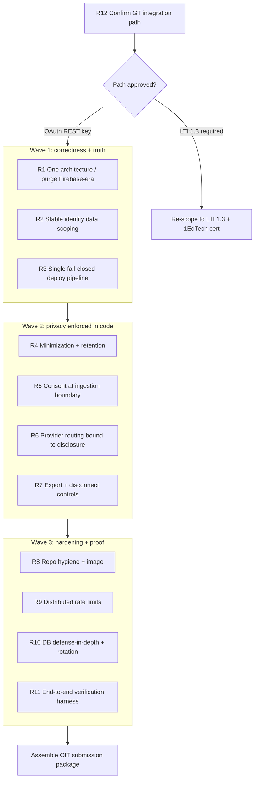

# CanvasSync — OIT / Canvas OAuth Readiness Audit

**Date:** 2026-06-05
**Scope:** Full codebase (`backend/`, `frontend/`, deploy config, docs, Supabase schema), plus external Canvas + Georgia Tech OIT requirements.
**Purpose:** Determine whether CanvasSync is ready to be submitted to GT OIT for a Canvas OAuth developer key, and identify root-cause problems (not symptoms) in integrations and data handling.

**Bottom line (2026-06-06 re-audit):** Remediation tracks R1–R12 are implemented. The
application is **ready for GT outreach** pending: (1) written GT path decision
(OAuth REST vs LTI), (2) GT developer key provisioning, (3) running migration 005
and `verify_deploy.py` against staging/prod and attaching results. See
`docs/OIT_FULL_AUDIT_2026-06-06.md` and `docs/GT_OIT_OUTREACH.md`.

This document has two parts, as requested:

- **Part 1 — Findings:** faulty integrations, careless data handling, and bugs, grouped by **root cause** rather than by symptom.
- **Part 2 — Remediation:** global, long-term, agent-actionable remediation tracks tied to those root causes. Not every finding gets its own fix; fixes target the underlying cause.

---

## Execution status (2026-06-06)

The remediation tracks have been implemented in code/docs (see git history):

| Track | Status | Key artifacts |
| --- | --- | --- |
| R1 One architecture | Done | `README.md` rewrite, `firebaseUser`→`canvasUser`, removed `init_firebase` alias, deleted Firestore-era + backup files |
| R2 Stable data scoping | Done | `build_canvas_account_key`, `migrations/005_repair_account_keys.py`, updated `resolve_canvas_credentials` + sync sites |
| R3 Fail-closed deploy | Done | `app_config.py`, hardened `validate_production_secrets`, single `deploy.ps1`, Vercel as sole frontend host |
| R4 Minimization + retention | Done | `STORE_RAW_CANVAS_JSON` gate, `retention_service.py`, `migrations/006_retention_indexes.sql`, retention endpoint |
| R5 Consent at ingestion | Done | `require_consent` decorator on all ingestion endpoints |
| R6 AI routing ↔ disclosure | Done | `DISCLOSED_AI_PROVIDERS` allowlist, strengthened `prompt_sanitizer.py` |
| R7 Data export/disconnect | Done | `/api/user/export`, `/api/user/disconnect-canvas`, Settings UI |
| R8 Repo hygiene | Done | dev scripts → `backend/tools/`, Dockerfile fixed, gitleaks in CI |
| R9 Distributed limits | Done | `consume_sync_spacing`, prod requires `RATELIMIT_STORAGE_URI` |
| R10 Defense-in-depth + ops | Done | `migrations/007_rate_limits_cascade.sql`, `docs/OPS_RUNBOOK.md` |
| R11 Verification harness | Done | `backend/tools/verify_deploy.py`, `docs/PROD_VERIFICATION.md` |
| R12 OIT submission package | Done | `docs/OIT_SUBMISSION.md` (incl. the LTI-vs-OAuth decision to confirm with GT) |

**Still requires a human decision (not code):** S-0.1 — the intended primary
model is a **GT App OAuth2 REST integration** (Canvas Developer Key). Confirm
with GT OIT / Digital Learning whether that is permitted, or whether all new
Canvas-connected student tools must use the LTI 1.3 vetting path (LTI is only the
primary path if in-Canvas placement is required). See `docs/OIT_SUBMISSION.md`.

---

## Part 0 — Strategic blocker (read first)

### S-0.1 Confirm the integration model with GT (OAuth2 REST is the intended primary path)

**Intended model (primary):** CanvasSync's proposed initial integration model is a **GT App student-productivity feature backed by a Canvas OAuth2 REST API client using a Canvas Developer Key**. It is **not** initially designed as a Canvas-embedded LTI tool. CanvasSync operates **outside** Canvas (its own React/Cloud Run app surfaced through the GT App experience) and each student **authorizes access to their own Canvas data** — courses, assignments, deadlines, and calendar/planning metadata — via the OAuth2 authorization-code flow against the Canvas REST API (`/api/v1/courses`, `/assignments`, files, modules, announcements). The OAuth2 model is the correct fit precisely because the product reads each student's *own* Canvas data and renders it in a GT App view, rather than launching inside Canvas.

**LTI 1.3 (open decision, secondary path only):** LTI 1.3 should become the primary path **only if** GT OIT / Digital Learning requires CanvasSync to launch from *within* Canvas or to appear in a Canvas placement (course navigation, modules, assignments, or another launch point). In that case LTI 1.3 is a **separate integration path**, not the default architecture for the GT App feature described above.

Per [Canvas Developer Keys docs](https://canvas.instructure.com/doc/api/file.developer_keys.html): a root-account developer key (the OAuth2 client_id/secret this app needs) is created and enabled **only by the root-account administrator** (GT OIT). Requested OAuth scopes must be a subset of the key's granted scopes, and the redirect URI domain must match the key.

**GT-specific timing caveat (unconfirmed):** GT's Digital Learning Team [Updated LTI Vetting Process (effective Jan 1, 2026)](https://sites.gatech.edu/dlt-blog/2026/03/26/updated-lti-vetting-process/) requires new third-party Canvas **LTI** integrations to be 1EdTech-certified LTI 1.3 and filed **at least 3 months** before the course start date. That public process and 3-month lead time **appear to apply to LTI integrations**; we have **not confirmed** whether the same vetting path and timing apply to a standalone OAuth2 REST developer-key app surfaced through the GT App. A non-LTI external web app that stores student access tokens and student course content off-premises (Supabase, Google Cloud Run, OpenRouter) will still likely warrant a security/privacy/data-handling review — which is exactly what the Part 1 remediations prepare for.

**Action (Part 2, R12):** Before requesting key provisioning, ask GT OIT / Digital Learning the explicit question: **can CanvasSync proceed as a GT App OAuth2 REST integration (root-account developer key), or must all new Canvas-connected student tools be routed through the LTI 1.3 vetting path?** This single answer determines the path and the schedule (treat the 3-month LTI lead time as a hard constraint *if* LTI is required).

---

## Part 1 — Findings (grouped by root cause)

Severity legend: **Blocker** (will fail an OIT review or breaks the product), **High**, **Medium**, **Low**.

### F1. Documentation/architecture drift — the repo describes a different app than it is (Blocker)

**Root cause:** There is no single source of truth for the architecture. The repo carries a complete *previous* architecture (Firebase Auth + Firestore + GCS + Lambda Labs) in its docs, naming, and even runtime code, layered under a *current* architecture (Canvas OAuth + Supabase + OpenRouter/DeepInfra + Cloud Run). Reviewers and future agents cannot tell which is real.

Evidence:

- [`README.md`](../README.md) (the document OIT will read first) describes "Google sign-in," "Firebase Authentication," "data syncs across devices via Firestore," "Lambda Labs inference API," "Firestore (cloud) / SQLite (local)," and a project structure listing `db_firestore.py` and `frontend/src/firebase.js` as the core. **None of this is the live system.** The live system is Canvas OAuth ([`backend/auth.py`](../backend/auth.py)), Supabase ([`backend/db_supabase.py`](../backend/db_supabase.py)), and OpenRouter ([`backend/ai/llm_model.py`](../backend/ai/llm_model.py) line 8: "Primary provider: OpenRouter").
- The `USE_FIRESTORE` env var is the master "cloud mode" switch, but cloud mode is **Supabase**, not Firestore. `db_supabase.py` defines `init_firebase()` as a "backward-compatible alias." `frontend/src/App.js` calls the Canvas-OAuth user `firebaseUser` (line 3330).
- Dead/parallel code paths still ship: `backend/db_firestore.py`, `backend/db.py` (SQLite), `frontend/src/firebase.js`, `frontend/src/backup-pre-mui-2026-02-21/`. The [`backend/Dockerfile`](../backend/Dockerfile) copies `db.py` (SQLite local mode) into the **production** image.

**Why it's a blocker:** An OIT reviewer comparing the README's data-flow diagram (browser → Firebase → Firestore → Lambda) against a privacy submission that says "Supabase + OpenRouter" will lose trust in the entire package. Internal contradictions read as "they don't know where their data goes."

### F2. Tenant data is scoped by a hash of the rotating OAuth access token (Blocker, correctness + data integrity)

**Root cause:** The system conflates *identity/account scope* with *secret credential material*. All user content (courses, assignments, file texts, announcements, syllabus rules, AI logs) is partitioned by `canvas_credential_key`, which is derived from the **bearer access token**:

```118:124:backend/db_supabase.py
def build_canvas_credential_key(api_url: str, token: str) -> str:
    """
    Build a stable, non-reversible key representing a Canvas credential pair.
    Used to scope data to the currently connected Canvas token.
    """
    raw = f"{normalize_canvas_url(api_url)}|{(token or '').strip()}"
    return hashlib.sha256(raw.encode("utf-8")).hexdigest()[:24]
```

Canvas OAuth access tokens **expire in 1 hour and are replaced on refresh** ([Canvas OAuth2 docs](https://canvas.instructure.com/doc/api/file.oauth.html)). The app refreshes them in [`backend/canvas_token_service.py`](../backend/canvas_token_service.py) `get_valid_canvas_credentials()` and re-persists a **new** `canvas_credential_key` on every refresh ([`db_supabase.py`](../backend/db_supabase.py) `update_user_canvas_oauth_credentials`, line ~467). Consequences:

- Every hourly token refresh produces a new `canvas_credential_key`. All previously synced rows (scoped under the old key) become **orphaned and invisible** to reads until the user re-syncs. Effective symptom: assignments "disappear" from the dashboard after the token rotates.
- Orphaned rows accumulate forever (DB bloat); they are only ever removed by full account deletion cascade.
- Read and write paths can disagree within a single request: sync paths recompute the key directly from the live token (`active_credential_key = build_canvas_credential_key(base_url, token)`, [`app.py`](../backend/app.py) line 2311), while read/bootstrap paths use the **stored** key returned by `get_valid_canvas_credentials` (`app.py` lines 1634, 1721, 1793, 1826). After a refresh these can be different values.

**Why it's a blocker:** This is a fundamental design flaw, not a tuning issue. Data scoping must key off **stable identity** (the internal user id, plus `canvas_user_id` + instance URL), never off a value that rotates by design.

### F3. Deployment configuration is incoherent across three hosting stories (Blocker for "does the pipeline work")

**Root cause:** Deployment is not codified as a single, reviewed pipeline; multiple half-finished deployment narratives coexist, and production behavior hinges on one platform-specific env var.

Evidence:

- **Three frontend hosting stories.** [`DEPLOY.md`](../DEPLOY.md) and [`scripts/deploy.ps1`](../scripts/deploy.ps1) deploy the frontend to **Firebase Hosting**. But [`vercel.json`](../vercel.json) and [`frontend/vercel.json`](../frontend/vercel.json) configure **Vercel**. CORS defaults in [`app.py`](../backend/app.py) allowlist `*.web.app`, `*.firebaseapp.com`, `canvassync.app`, and (non-prod only) `*.vercel.app`. There is no single answer to "where does the frontend run?"
- **Required secrets are not provisioned by the deploy scripts.** Production boot requires `SESSION_SECRET_KEY`, `CANVAS_TOKEN_ENCRYPTION_KEY`, `SUPABASE_URL`, `SUPABASE_SERVICE_KEY` ([`auth.py`](../backend/auth.py) `validate_production_secrets`, lines 79-97). The root [`deploy.ps1`](../deploy.ps1) sets only `USE_FIRESTORE=true`, `GCP_PROJECT_ID`, `FIREBASE_PROJECT_ID`, `GCS_BUCKET`, and the encryption-key secret — and additionally references a non-existent `frontend/.env.production` with `REACT_APP_FIREBASE_*` values. Neither deploy script sets `SUPABASE_*`, `SESSION_SECRET_KEY`, `CANVAS_OAUTH_CLIENT_ID/SECRET`, `CANVAS_OAUTH_REDIRECT_URI`, or `FRONTEND_URL`. As scripted, a fresh deploy either **fails to boot** (RuntimeError on missing secrets) or depends on undocumented manual console configuration.
- **"Production" is detected only by `K_SERVICE`** (a Cloud Run-injected var): `_is_production = bool(os.getenv("K_SERVICE"))` ([`auth.py`](../backend/auth.py) line 45; [`app.py`](../backend/app.py) lines 47-51, 119). On any host that does not set `K_SERVICE` (Vercel functions, a VM, a container elsewhere), `_is_production` is false; if `USE_FIRESTORE` is also unset, the backend silently runs in **local no-auth mode** (see F11).

**Why it's a blocker:** "Verify the whole pipeline works as intended" cannot be answered yes while the deploy path is ambiguous and missing the secrets the app requires to start.

### F4. Data minimization and retention are documented but not implemented (Blocker for privacy review)

**Root cause:** Compliance is described in docs ahead of the code. The privacy posture promises minimization/retention that the code does not enforce — "compliance theater" that a reviewer will test and find hollow.

Evidence:

- **Raw Canvas payloads are always stored.** Full assignment JSON is persisted on every sync: `'raw_canvas_json': json.dumps(a, ...)` ([`app.py`](../backend/app.py) line 2716). Full announcement JSON: `'raw_json': json.dumps(a)` (line 2533). There is **no `STORE_RAW_CANVAS_JSON` gate** in the code, despite [`docs/OIT_APPROVAL_PLAN.md`](OIT_APPROVAL_PLAN.md) (B1) and [`docs/INSTITUTIONAL_COMPLIANCE.md`](INSTITUTIONAL_COMPLIANCE.md) claiming raw JSON is minimized/gated.
- **No retention/TTL enforcement exists.** `backend/retention_service.py`, `migrations/003_retention_indexes.sql`, and any scheduled purge described in the plan **do not exist**. `course_file_texts.extracted_text` holds full syllabus/module text (which routinely contains instructor names, emails, office hours, GT IDs) and is retained indefinitely.
- The schema retains `legal_consent_*`, encrypted tokens, and all content with no expiry ([`backend/supabase_schema.sql`](../backend/supabase_schema.sql)).

**Why it's a blocker:** OIT will ask "why do you store X, and for how long?" The honest current answer is "everything, forever, including raw API dumps." The docs say otherwise, which is worse than saying nothing.

### F5. Consent is enforced at the wrong layer (High)

**Root cause:** Consent is treated as an "AI feature gate" rather than a **data-collection boundary**. The server only blocks the AI step; it ingests and stores Canvas content before any server-side consent check.

Evidence:

- The only server-side consent enforcement is on `/api/resolve_course_dates`:

```3648:3654:backend/app.py
    if USE_FIRESTORE and not is_demo_user(user_id, getattr(request, "is_demo", False)):
        from db_supabase import user_has_legal_consent
        if not user_has_legal_consent(user_id):
            return jsonify({
                "error": "Legal consent required before AI date resolution.",
                "code": "legal_consent_required",
            }), 403
```

- `POST /api/sync_assignments`, `/api/sync_course_materials`, `/api/sync_announcements`, and `/api/canvas/courses` have **no consent gate**. They fetch and persist course data, announcements, and full extracted file text *before* consent is verified server-side.
- The client UI hides the app behind [`ConsentModal`](../frontend/src/components/ConsentModal.js) until accepted ([`App.js`](../frontend/src/App.js) line 3330), but the **server boundary does not enforce it** — a non-browser client (or a future GT-App shell) could call sync endpoints without consent.

**Why it matters:** For FERPA/PII framing, consent must precede *collection*, not just the optional AI inference on already-collected data.

### F6. AI/PII handling and provider-routing disclosure (Resolved / monitor)

**Current state:** The production route is OpenRouter gateway to DeepInfra only,
with per-request ZDR required, provider data collection denied, and provider
fallback disabled. Routing is bound to `DISCLOSED_AI_PROVIDERS`, and
user-facing copy now describes redaction as best-effort rather than guaranteed
anonymity.

Residual risk:

- [`backend/ai/prompt_sanitizer.py`](../backend/ai/prompt_sanitizer.py) is regex-only: emails, phone-like patterns, 9-digit IDs, and profile-style URLs. It does **not** remove instructor/student names, partial IDs, non-US phone formats, addresses, etc. Disclosures must continue to say that course text is not guaranteed anonymous.
- The DeepInfra-only route relies on OpenRouter's current provider policy metadata. Keep `OPENROUTER_ENFORCE_ZDR=true`, `OPENROUTER_DENY_DATA_COLLECTION=true`, `OPENROUTER_PROVIDER_ONLY=deepinfra`, and `OPENROUTER_ALLOW_FALLBACK=false`.

### F7. Token-lifecycle shims and misleading field names hide plaintext + stale-key behavior (High)

**Root cause:** Backward-compatibility shims from the Firestore era were never removed, leaving misleading names and silent fallbacks in the credential path.

Evidence:

- Legacy **plaintext** Canvas tokens are accepted and returned as-is (only a log warning), with **no hard rejection in production**, contradicting [`docs/SECURITY_AUDIT.md`](SECURITY_AUDIT.md) ("reject in production read path"):

```64:88:backend/db_supabase.py
def decrypt_canvas_token(stored_value: str) -> Optional[str]:
    ...
    if not str(stored_value).startswith(TOKEN_ENCRYPTION_PREFIX):
        logger.warning("Legacy plaintext Canvas token detected. ...")
        return stored_value
```

- Field names lie: `get_user_canvas_credentials` returns `"encrypted_token": decrypted_token` (line ~509) and `get_valid_canvas_credentials` returns `"encrypted_token": access_token` (a plaintext token). Anything trusting that field name as ciphertext is wrong.
- `get_valid_canvas_credentials` returns the **stale** stored credential key from the pre-refresh user object even when it just wrote a new one (interacts with F2).

### F8. User-data controls promised to OIT do not exist (High)

**Root cause:** Same as F4 — docs precede implementation. The privacy/consent surface advertises controls that aren't built.

Evidence:

- `GET /api/user/data-export` and `POST /api/user/disconnect-canvas` are listed in [`docs/OIT_APPROVAL_PLAN.md`](OIT_APPROVAL_PLAN.md) (B3) but **are not implemented** in [`app.py`](../backend/app.py). Only `POST /api/user/delete-data` (full erasure) and `POST /api/auth/logout` (revoke + clear) exist.
- The client `disconnectCanvas()` ([`App.js`](../frontend/src/App.js) line 2545) clears local state only; there is no server-side "disconnect but keep account."
- [`ConsentModal`](../frontend/src/components/ConsentModal.js) tells users they can delete data "from Settings (when available)" — i.e., not available.

### F9. Repository hygiene: destructive/dev tooling and dead code ship alongside the app (Medium, but reviewer-visible)

**Root cause:** No separation between operational/throwaway tooling and the deployable application. An OIT reviewer browsing the repo will see this.

Evidence (all under `backend/`): `wipe_all_tables.py`, `wipe_firestore.py`, `wipe_assignments.py`, `wipe_course_file_text.py`, `reset_db.py`, `purge.py`, `run_cleanup.py`, `migrate_canvas_tokens.py`, `download_canvas_files.py`, `debug_dates.py`, `debug_files.py`, `check_schema.py`, `testa.py`, `ts_scrapping.py`, `last_good.py`. Plus dead architecture: `db_firestore.py`, `db.py`, `frontend/src/firebase.js`, `frontend/src/backup-pre-mui-2026-02-21/`, and `frontend/src/pages/PrivateTestingLogsPage.js`. The production [`Dockerfile`](../backend/Dockerfile) bundles `db.py` (SQLite local mode) into the image.

**Why it matters:** Mass-delete scripts and a half-removed prior stack signal an immature codebase to a security reviewer and widen the audit surface unnecessarily.

### F10. Rate limiting and sync throttling are in-process — ineffective on autoscaled Cloud Run (Medium)

**Root cause:** Stateful protections implemented in process memory on a horizontally-autoscaled, stateless platform.

Evidence: `limiter` defaults to `storage_uri="memory://"` unless `RATELIMIT_STORAGE_URI` is set ([`app.py`](../backend/app.py) lines 164-171); `sync_throttle.py` uses a per-process dict. With multiple Cloud Run instances, per-IP/per-user limits are enforced **per instance**, so caps are bypassable by spreading requests. [`docs/SECURITY_AUDIT.md`](SECURITY_AUDIT.md) marks S6 "implemented," but the default is still memory. (The DB-backed `consume_hourly_rate_limit` for sync is the exception and is sound.)

### F11. Security depends on a single platform env var; local no-auth mode is one misconfig away in production (Medium/High)

**Root cause:** The "is this a secured deployment?" decision is bound to `K_SERVICE`/`USE_FIRESTORE` rather than an explicit, fail-closed environment declaration.

Evidence: If `K_SERVICE` is unset and `USE_FIRESTORE` is not `true`, the app runs in **local mode with no authentication** (OAuth/demo routes not registered, body tokens accepted, no `@require_auth` enforcement semantics for the cloud paths). The Dockerfile does not set `USE_FIRESTORE`; only Cloud Run's injected `K_SERVICE` flips the app into secure mode at runtime ([`app.py`](../backend/app.py) lines 47-51). Deploying the same image anywhere that doesn't set `K_SERVICE` yields an unauthenticated, body-token-accepting API. This is a fail-open default.

### F12. Database blast radius: all access via one service-role key, no per-user defense in depth (Medium)

**Root cause:** Authorization lives entirely in the application layer; the database has deny-all RLS plus a single all-powerful `service_role` key that bypasses RLS.

Evidence: [`supabase_schema.sql`](../backend/supabase_schema.sql) and [`migrations/002_fix_rls.sql`](../backend/migrations/002_fix_rls.sql) deny `anon`/`authenticated` entirely; the backend uses `SUPABASE_SERVICE_KEY` for everything ([`db_supabase.py`](../backend/db_supabase.py) `init_db`). Deny-all RLS is the right baseline, but: (a) if the service key leaks, every tenant's data is exposed with no second layer; (b) `rate_limits.user_id` is `TEXT` (not a UUID FK), so it isn't covered by the `ON DELETE CASCADE` that protects other tables — it is cleaned only by an explicit delete in `delete_all_user_data`. There is no key-rotation runbook.

### F13. Information disclosure in error responses and logs (Low/Medium)

**Root cause:** Upstream Canvas error bodies and verbose `print` diagnostics are surfaced to clients/logs.

Evidence: `/api/canvas/courses` returns `"details": r.text[:500]` from Canvas on failure ([`app.py`](../backend/app.py) ~2349-2353); paginated-fetch `RuntimeError` includes the first 200 chars of the Canvas response body; `GET /api/ai/usage-logs` returns the full `raw_json` telemetry payload per entry; sync paths `print()` course names/file names to stdout (Cloud Run logs). No access tokens were found in logs, but course content and upstream error text leak into logs/responses.

---

## Part 1 — Findings summary

- **Blockers:** F1 (doc/architecture drift), F2 (token-hash data scoping), F3 (deployment incoherence + missing prod secrets), F4 (minimization/retention not implemented). Plus the strategic blocker S-0.1 (integration model vs GT's path).
- **High:** F5 (consent at wrong layer), F6 (AI/PII guarantees vs reality + fallback disclosure), F7 (plaintext/stale-key shims), F8 (missing export/disconnect), F11 (fail-open prod detection).
- **Medium:** F9 (repo hygiene), F10 (in-memory rate limits), F12 (DB blast radius).
- **Low/Medium:** F13 (error/log disclosure).

What is genuinely solid (keep): PKCE + HMAC-signed state cookie + HttpOnly session, no token in redirect URL ([`auth.py`](../backend/auth.py)); Fernet token encryption; SSRF allowlisting + DNS-public-IP checks + pagination host re-validation ([`app.py`](../backend/app.py) `normalize_canvas_base_url`); deny-all RLS baseline; security headers + CSP; demo session gated off in prod; DB-backed hourly sync limiter.

---

## Part 2 — Remediation (root-cause, long-term, agent-actionable)

Each track is written so an autonomous coding agent can pick it up: it names the root cause, the target end-state, the concrete files, and an acceptance check. Tracks are intentionally larger than single bug fixes — they target the cause, per your instruction to avoid temporary patches.

### R12. Confirm the integration model with GT (addresses S-0.1) — DO THIS FIRST

- **Intended model (primary):** A **GT App student-productivity feature backed by a Canvas OAuth2 REST API client / Canvas Developer Key** — CanvasSync runs outside Canvas and each student authorizes access to their own Canvas data (courses, assignments, deadlines, calendar/planning metadata). This is the appropriate model because the product reads each student's *own* data and surfaces it in the GT App, rather than launching inside Canvas.
- **LTI 1.3 (secondary, open decision):** Treat LTI 1.3 as a *separate* path that becomes primary **only if** GT requires CanvasSync to launch from within Canvas or appear in a Canvas placement (course nav, modules, assignments). It is not the default architecture for the GT App feature.
- **Root cause:** Ambiguity about whether GT will issue a root-account OAuth2 developer key for a GT App external REST app, vs requiring the LTI 1.3 + 1EdTech vetting path. The public LTI vetting process and 3-month lead time appear to apply to LTI integrations; it is **unconfirmed** whether they also apply to standalone OAuth2 REST developer-key apps.
- **End-state:** A written decision from GT OIT / Digital Learning on the path, and a read-only scope list pre-agreed with the root-account admin.
- **Agent actions:** Draft the OIT outreach package: one-page architecture (corrected per R1), the requested **read-only** scope list (`url:GET|/api/v1/courses`, `.../assignments`, `.../modules`, `.../files`, `.../discussion_topics`, `/api/v1/users/self`), the production redirect URI (`{BACKEND_URL}/api/auth/canvas/callback`), and the data-handling summary (post-R4). Explicitly ask: **"Can CanvasSync proceed as a GT App OAuth2 REST integration (root-account developer key), or must all new Canvas-connected student tools be routed through the LTI 1.3 vetting path?"** If LTI is required, treat the ≥3-month lead time as a hard constraint.
- **Acceptance:** GT's path decision is documented in `docs/OIT_SUBMISSION.md`; no further engineering proceeds on assumptions that contradict it.

### R1. Establish one source of truth for architecture; purge the Firebase-era narrative (addresses F1, F9)

- **Root cause:** Two architectures coexist in docs, code, and naming.
- **End-state:** README, diagrams, and naming all describe exactly one system (Canvas OAuth + Supabase + OpenRouter + Cloud Run + chosen frontend host). No Firestore/Lambda/Google-sign-in references remain.
- **Agent actions:** Rewrite [`README.md`](../README.md) to match the live stack and request flow. Delete dead code: `backend/db_firestore.py`, `backend/db.py` (if local SQLite mode is dropped — see R3), `frontend/src/firebase.js`, `frontend/src/backup-pre-mui-2026-02-21/`. Rename the master flag `USE_FIRESTORE` → `APP_MODE`/`CLOUD_MODE` (or remove per R3) and the `firebaseUser` symbol → `canvasUser`. Remove the `init_firebase` alias.
- **Acceptance:** Grep for `firebase|firestore|lambda` (case-insensitive) across the repo returns only intentional history/changelog entries; README diagram matches `docs/INSTITUTIONAL_COMPLIANCE.md`.

### R2. Re-architect tenant data scoping around stable identity (addresses F2, F7)

- **Root cause:** Data partitioned by a hash of the rotating bearer token.
- **End-state:** All content is scoped by the internal `user_id` (already the primary FK) plus a **stable** Canvas-account discriminator derived from `canvas_user_id` + normalized instance URL — never the token. The token rotates freely with zero data impact.
- **Agent actions:** Replace `build_canvas_credential_key(api_url, token)` with `build_canvas_account_key(api_url, canvas_user_id)` (no secret material). Persist `canvas_user_id` at OAuth callback (already fetched in [`auth.py`](../backend/auth.py) `canvas_oauth_callback`). Update all read/write call sites in [`app.py`](../backend/app.py) and [`db_supabase.py`](../backend/db_supabase.py) to use the stable key. Write a migration that recomputes the key for existing rows and merges orphaned duplicates (dedupe on `user_id + course + canvas_assignment_id`). Stop re-deriving/re-writing the key on token refresh in [`canvas_token_service.py`](../backend/canvas_token_service.py).
- **Acceptance:** After forcing a token refresh (set `canvas_token_expires_at` in the past), a re-open of the dashboard shows the same data with no re-sync; no new orphaned rows appear; integration test simulates two consecutive refreshes and asserts identical `account_key`.

### R3. Codify deployment as a single, fail-closed pipeline (addresses F3, F11)

- **Root cause:** Multiple deployment narratives; production-mode inferred from `K_SERVICE`; required secrets not provisioned by scripts.
- **End-state:** One documented host for the frontend (pick Vercel **or** Firebase Hosting and delete the other's config), one backend deploy path that provisions **every** required secret, and an explicit `APP_ENV=production|development` that fails closed (refuses to boot without auth + secrets) regardless of platform.
- **Agent actions:** Choose the frontend host; remove the unused config (`vercel.json` + `frontend/vercel.json`, or `scripts/deploy.ps1`'s Firebase Hosting path) and reconcile CORS defaults to the chosen origin(s). Replace `K_SERVICE`-based detection with an explicit `APP_ENV` read in [`auth.py`](../backend/auth.py)/[`app.py`](../backend/app.py); when `APP_ENV=production`, `validate_production_secrets()` must run and auth must be mandatory. Make the backend deploy (Secret Manager + `--set-secrets`/`--set-env-vars`) set `SUPABASE_URL`, `SUPABASE_SERVICE_KEY`, `SESSION_SECRET_KEY`, `CANVAS_TOKEN_ENCRYPTION_KEY`, `CANVAS_OAUTH_CLIENT_ID/SECRET`, `CANVAS_OAUTH_REDIRECT_URI`, `FRONTEND_URL`, `RATELIMIT_STORAGE_URI`. Decide whether to keep local SQLite no-auth mode at all; if kept, make it impossible to enable when `APP_ENV=production`.
- **Acceptance:** A clean deploy from the script boots successfully and serves OAuth; removing any required secret causes a startup failure (not a silent insecure boot); deploying without `APP_ENV=production` cannot serve authenticated routes in an unauthenticated mode.

### R4. Implement real data minimization + retention so code matches the privacy policy (addresses F4, F13)

- **Root cause:** Minimization/retention documented, never coded.
- **End-state:** The system stores the minimum needed for the calendar and enforces TTLs automatically; the privacy policy describes the actual behavior.
- **Agent actions:** Add `STORE_RAW_CANVAS_JSON` (default **false** in production) and stop writing `raw_canvas_json`/announcement `raw_json` unless explicitly enabled ([`app.py`](../backend/app.py) lines 2533, 2716; mirror in any SQLite path). Build `backend/retention_service.py` with `purge_stale_user_content(...)` honoring `COURSE_FILE_TEXT_RETENTION_DAYS` / `ANNOUNCEMENT_RETENTION_DAYS`, plus a `created_at`/`synced_at` index migration. Schedule it (Cloud Run Job / Cloud Scheduler). Truncate stored syllabus text to what the calendar/AI need, or drop it after date resolution. Stop returning full `raw_json` from `GET /api/ai/usage-logs`; stop echoing Canvas `r.text` to clients. Then update [`docs/legal/PRIVACY_POLICY.md`](legal/PRIVACY_POLICY.md) and [`docs/INSTITUTIONAL_COMPLIANCE.md`](INSTITUTIONAL_COMPLIANCE.md) to state the real retention numbers.
- **Acceptance:** In production config, DB rows contain no raw Canvas dumps; a scheduled purge deletes content older than the TTL (verified by a test row with a backdated timestamp); privacy policy TTLs match env defaults.

### R5. Move consent and minimization to the data-ingestion boundary (addresses F5)

- **Root cause:** Consent enforced only on the AI step.
- **End-state:** No Canvas data is fetched or stored for a non-demo user until server-recorded consent exists; consent enumerates the exact data categories and the exact providers used.
- **Agent actions:** Add the `user_has_legal_consent` gate to `sync_assignments`, `sync_course_materials`, `sync_announcements`, and `canvas/courses` in [`app.py`](../backend/app.py) (a shared decorator/helper, mirroring the existing `resolve_course_dates` check). Keep the demo bypass explicit. Update the consent copy to match providers actually reachable (see R6).
- **Acceptance:** With consent unset, every sync endpoint returns `403 legal_consent_required`; only after consent does ingestion succeed.

### R6. Treat anonymization as best-effort and bind provider routing to disclosure (addresses F6)

- **Root cause:** Over-stated anonymity and provider routing that previously was not fully aligned with consent text.
- **End-state:** Docs and UI describe redaction as best-effort everywhere; the only providers data can reach are exactly those disclosed; enabling a new provider is impossible without updating the disclosure.
- **Agent actions:** Keep [`docs/OPENROUTER_PRIVACY.md`](OPENROUTER_PRIVACY.md) and consent copy aligned with `DISCLOSED_AI_PROVIDERS=openrouter,deepinfra`. Keep provider fallback disabled; any future provider addition must update the disclosure first and preserve ZDR/data-collection constraints. Strengthen `prompt_sanitizer.py` (add name-pattern and address heuristics) but never describe it as removal of all PII.
- **Acceptance:** Consent text and `OPENROUTER_PRIVACY.md` list the same providers as the allowlist; every LLM call uses DeepInfra-only routing with ZDR required, data collection denied, and fallback disabled.

### R7. Build the user-data controls the policy promises (addresses F8)

- **Root cause:** Advertised controls not implemented.
- **End-state:** Self-service export and disconnect exist and are reachable from Settings.
- **Agent actions:** Implement `GET /api/user/data-export` (rate-limited, `@require_auth`, returns the user's courses/assignments/file-text as JSON) and `POST /api/user/disconnect-canvas` (revoke Canvas token + clear credentials, keep account/prefs) in [`app.py`](../backend/app.py)/[`canvas_token_service.py`](../backend/canvas_token_service.py). Wire a Settings → Privacy & Data section in [`frontend/src/App.js`](../frontend/src/App.js); make `disconnectCanvas()` call the new server endpoint. Update [`ConsentModal`](../frontend/src/components/ConsentModal.js) copy once Settings is real.
- **Acceptance:** A user can export then delete/disconnect entirely from the UI with no support contact; disconnect leaves the account but removes Canvas access.

### R8. Repository hygiene and least-privilege image (addresses F9)

- **Root cause:** Operational/dev tooling mixed into the deployable repo/image.
- **End-state:** The deployable backend contains only runtime code; destructive scripts live in a clearly separated, non-shipped location (or are deleted); secret scanning runs in CI.
- **Agent actions:** Move `wipe_*`, `reset_db`, `purge`, `debug_*`, `testa`, `ts_scrapping`, `download_canvas_files`, `last_good`, `check_schema`, `migrate_canvas_tokens` into `tools/` (excluded from the Docker context) or delete them. Trim the [`Dockerfile`](../backend/Dockerfile) to runtime modules only (drop `db.py` if SQLite mode is removed in R3). Extend [`.github/workflows/security.yml`](../.github/workflows/security.yml) with secret scanning (e.g. gitleaks) and keep the dependency audit.
- **Acceptance:** Production image contains no wipe/debug scripts; CI fails on committed secrets; `docker build` context excludes `tools/`.

### R9. Distributed rate limiting as a hard production requirement (addresses F10)

- **Root cause:** In-process limits on an autoscaled platform.
- **End-state:** All rate limits and sync throttles share a distributed store (Redis); production refuses to start with `memory://`.
- **Agent actions:** Require `RATELIMIT_STORAGE_URI` (Redis) when `APP_ENV=production` (add to `validate_production_secrets`). Move `sync_throttle.py`'s per-process dict to the same Redis (or to the existing DB-backed bucket). Provision Redis in the deploy pipeline (R3).
- **Acceptance:** With two backend instances, a per-user limit is enforced globally (integration test hitting both instances); production boot fails if storage is `memory://`.

### R10. Database defense-in-depth and key rotation (addresses F12)

- **Root cause:** Single all-powerful key; no second authz layer; no rotation runbook.
- **End-state:** Documented, time-boxed service-key rotation; `rate_limits` covered by cascade or scheduled cleanup; a clear written threat model for the service-key blast radius (and, if feasible later, per-user RLS using signed claims).
- **Agent actions:** Convert `rate_limits.user_id` to a UUID FK with `ON DELETE CASCADE` (migration), or add it to the retention purge. Write `docs/OPS_RUNBOOK.md` covering service-key rotation and incident response. Evaluate moving read paths to a JWT-scoped role with real per-user RLS as a stretch goal.
- **Acceptance:** Deleting a user removes their `rate_limits` rows; a runbook with rotation steps exists and is referenced in the OIT package.

### R11. Verification harness for the full pipeline (cross-cutting)

- **Root cause:** No automated end-to-end proof that the pipeline works as intended.
- **End-state:** A scripted suite covering OAuth login (no token in URL), cookie session cross-origin, 1-hour refresh, logout revoke, delete-data cascade, RLS anon-deny, demo-404-in-prod, consent gating on all ingestion endpoints, sanitized-prompt + ZDR, export-returns-own-data-only, and TTL purge.
- **Agent actions:** Implement `docs/PROD_VERIFICATION.md` as a runnable checklist/test rather than a manual table; tie it to CI where possible.
- **Acceptance:** All checks pass against a staging deploy before the OIT submission is sent.

---

## Recommended sequencing (for agents)



**Why this order:**

1. **R12 first** — confirm the GT path. OAuth2 REST (GT App developer key) is the intended primary model; only fall back to LTI 1.3 if GT requires in-Canvas placement. Do not build on an unconfirmed assumption.
2. **Wave 1** makes the system *correct and truthful*: data stops disappearing on token refresh (R2), the repo describes what actually runs (R1), and deploys are reproducible and fail-closed (R3). These are the blockers.
3. **Wave 2** makes the *privacy claims real*: minimization/retention (R4), consent before collection (R5), provider/disclosure binding (R6), and the promised user controls (R7). These convert the docs from aspiration to fact.
4. **Wave 3** hardens and *proves* it: hygiene (R8), distributed limits (R9), DB blast-radius + rotation (R10), and an automated end-to-end verification (R11) you can show OIT.

## Closing assessment

The Canvas OAuth core is good engineering and is, as you suspected, "just missing the developer key" in the narrow sense of the auth handshake. The risk to approval is not the OAuth handshake — it is everything wrapped around it: **a repo that documents a different system than it runs, a data-scoping scheme that loses data on every hourly token refresh, deploy scripts that don't provision the secrets the app requires, and privacy controls that exist in docs but not in code.** A competent OIT reviewer will find these quickly, and the doc/code contradictions will undermine trust in the rest of the submission.

Fix the root causes in Part 2 (in the recommended order), get GT's integration-path answer in writing first, and the developer-key request becomes a formality rather than a gamble.

---

*Companion documents: [OIT_APPROVAL_PLAN.md](OIT_APPROVAL_PLAN.md), [CANVAS_TOS_COMPLIANCE.md](CANVAS_TOS_COMPLIANCE.md), [INSTITUTIONAL_COMPLIANCE.md](INSTITUTIONAL_COMPLIANCE.md), [SECURITY_AUDIT.md](SECURITY_AUDIT.md), [OPENROUTER_PRIVACY.md](OPENROUTER_PRIVACY.md). Where those documents and this audit disagree, this audit reflects the current state of the code as of the date above.*
